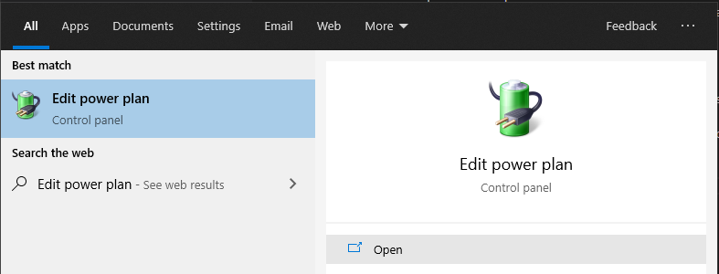
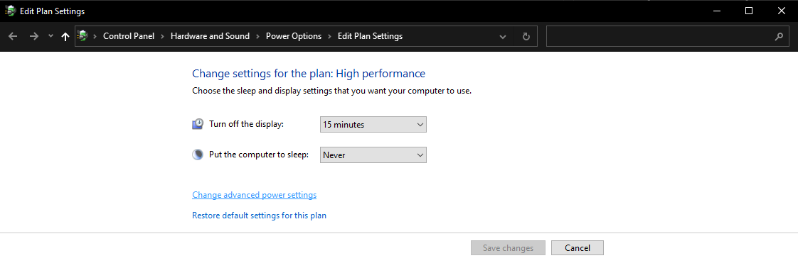
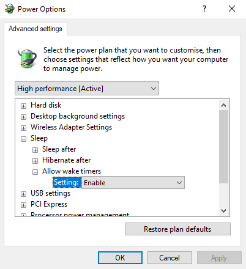

# zoom-earlybird
Python bot that automatically signs in to Zoom using SSO (only supported domains) and attends a meeting schedule.\
Requires Python 3.6 or greater.

# Contributing
Contributions and pull-requests are very much welcome.\
These topics stand out:
- Passing URLs to zoom client on macOS (executing binary or using `open`?)
- Support for more SSO domains

# Requirements
Python 3.6 or newer is required to run this.\
The dependencies listed in the `requirements.txt` file must also be satisfied:
- `requests`
- `psutil`

You can do this with `python -m pip install -r requirements.txt`

# Setup
Must be run with the current working directory set.

```bash
cd zoom-earlybird
python main.py
```

Firstly the `config.json` file will be created. You will have to provide:

- The path to your zoom executable so that we can pass URLs to it:\
On Windows, follow the shortcuts until you find your `Zoom.exe`, then copy it's location and submit the full path.\
It should look something like: `C:\Users\<username>\AppData\Roaming\Zoom\bin\Zoom.exe`\
On Linux `whereis` will be used to attempt to locate the install location.\
It should look somethin like: `/usr/bin/zoom`
- Your SSO identity provider's URL. Choose one from the [list](#sso-identity-providers), enter your own or leave it empty if you don't want to use SSO login.
- SSO username and password, once again no need to fill in if not using SSO.

Lastly you will need to fill in your schedule in the `config.json` file.\
Follow the template in JSON syntax and use URLs in their standard format:\
`https://videoconf-colibri.zoom.us/j/00000000000?pwd=bm8gcGFzc3dvcmQgaGVyZSAK`

# Zoom Desktop Client Setup
For automatic call joining to work properly you'll want to set your Zoom configuration such that it defaults to join without video and with muted audio.

In settings under Video, choose:\
\


In settings under Audio, choose:\
\


# Usage
After editing your config file the interactive menu will be presented.\
The options are:

- `sso`\
Attempt to run the SSO login flow with the provided details, passing the resulting URL to zoom.
- `test-wakeup`\
Attempt to put the machine to sleep for 2 minutes.
- `arm`\
Arm the script to attend all the meetings scheduled for the day of the first upcoming meeting, and susepend the machine with a scheduled wakeup.
- `arm-nosleep`\
Arm the script to attend all the meetings scheduled for the day of the first upcoming meeting but don't suspend the machine.

# Sleep & Wakeup
If the next meeting is scheduled for more than 5 minutes in to the future the machine will be put to sleep and awaken in time for the meeting.\
In order for this to work your operating system has to allow RTC wakeups to happen and you to schedule them.\
The operating system's Lock Screen when waking up from sleep is not a problem, everything will work in the background since we are running the binary directly instead of using UI.

## RTC Wakeups on Windows
On Windows, a task is scheduled with Task Scheduler.\
The task runs `cmd.exe /k exit` which does nothing, but is set to wake up the computer to execute it.\
It is also worth checking, especially on laptops, if the currently active power plan is set to allow RTC wakeups:

- Browse to `Edit power plan`\


- Choose `Change advanced power settings`\


- In `Sleep` make sure `Allow wake timers` is set to `Enable`\


After scheduling the task `psshutdown.exe` is executed to suspend the machine.

## RTC Wakeups on Linux
On Linux `rtcwake -m mem` is used to suspend the machine to RAM for a certain amount of time.\
Depending on your Linux distro this might not be available or enabled so you might have to investigate.

## RTC Wakeups on macOS
On macOS `pmset` is used to schedule a relative wakeup.\
The machine is then put to sleep with `pmset sleepnow`.

# Updates
An update check against this repository is performed and at run-time.\
If a newer version is available an update will be carried out.

# Telemtry
At first run a random ID will be generated and stored in your `config.json`\
The software will phone home to report the following telemetry data:
- Commit hash (version) you are running

To opt out of telemetry set your `"telemetry_id"` to `"opt-out"` in your `config.json` file.

# SSO Identity Providers
This list contains some SSO login domains along with the URL you should choose.

### Universidades
| URL                                                        |   Support   | Name                                              |
|:-----------------------------------------------------------|:-----------:|:--------------------------------------------------|
| `https://idp.iscte-iul.pt/idp/shibboleth`                  | `SUPPORTED` | ISCTE-IUL - Instituto Universitario de Lisboa
| `https://idprovider.uab.pt/idp/shibboleth`                 | `UNKNOWN`   | Universidade Aberta
| `https://idp.ual.pt/idp/shibboleth`                        | `UNKNOWN`   | Universidade Autónoma de Lisboa
| `https://wayf.ucp.pt`                                      | `UNKNOWN`   | Universidade Católica Portuguesa
| `https://idp.ubi.pt/idp/shibboleth`                        | `UNKNOWN`   | Universidade da Beira Interior
| `https://idp2.uma.pt/idp/shibboleth`                       | `UNKNOWN`   | Universidade da Madeira
| `https://idp.ua.pt/idp/shibboleth`                         | `UNKNOWN`   | Universidade de Aveiro
| `https://idp.uc.pt/idp/shibboleth`                         | `UNKNOWN`   | Universidade de Coimbra
| `https://aai.uevora.pt/idp/shibboleth`                     | `UNKNOWN`   | Universidade de Évora
| `https://id.fc.ul.pt/simplesaml/saml2/idp/metadata.php`    | `UNKNOWN`   | ULisboa - Faculdade de Ciências
| `https://aai.isa.utl.pt/simplesaml/saml2/idp/metadata.php` | `UNKNOWN`   | ULisboa - Instituto Superior de Agronomia
| `https://idp.iseg.ulisboa.pt/idp/shibboleth`               | `UNKNOWN`   | ULisboa - Instituto Superior de Economia e Gestão
| `https://id.tecnico.ulisboa.pt/saml`                       | `UNKNOWN`   | ULisboa - Instituto Superior Técnico
| `https://wayf.ulisboa.pt`                                  | `UNKNOWN`   | Universidade de Lisboa
| `https://idp.utad.pt/idp/shibboleth`                       | `UNKNOWN`   | Universidade de Trás os Montes e Alto Douro
| `https://si-saai.ualg.pt/idp/shibboleth`                   | `UNKNOWN`   | Universidade do Algarve
| `https://idp.uminho.pt/idp/shibboleth`                     | `UNKNOWN`   | Universidade do Minho
| `https://wayf.up.pt/idp/shibboleth`                        | `UNKNOWN`   | Universidade do Porto
| `https://login.uac.pt/idp/shibboleth`                      | `UNKNOWN`   | Universidade dos Açores
| `https://idp.universidadeeuropeia.pt/idp/shibboleth`       | `UNKNOWN`   | Universidade Europeia
| `https://idp.ufp.pt/idp/shibboleth`                        | `UNKNOWN`   | Universidade Fernando Pessoa
| `https://idp.lis.ulusiada.pt/idp/shibboleth`               | `UNKNOWN`   | Universidade Lusíada
| `https://aai.ulusofona.pt/idp/shibboleth`                  | `UNKNOWN`   | Universidade Lusófona
| `https://idp.ulp.pt/idp/shibboleth`                        | `UNKNOWN`   | Universidade Lusófona do Porto
| `https://wayf.unl.pt/wayf/"`                               | `UNKNOWN`   | Universidade Nova de Lisboa
| `https://idp.uportu.pt/idp/shibboleth`                     | `UNKNOWN`   | Universidade Portucalense

### Politécnicos
| URL                                                        |   Support   | Name                                                    |
|:-----------------------------------------------------------|:-----------:|:--------------------------------------------------------|
| `https://idp.ipluso.pt/idp/shibboleth`                     | `UNKNOWN`   | Instituto Politécnico da Lusófonia
| `https://idp.ipbeja.pt/idp/shibboleth`                     | `UNKNOWN`   | Instituto Politécnico de Beja
| `https://idp.ipb.pt/idp/shibboleth`                        | `UNKNOWN`   | Instituto Politécnico de Bragança
| `https://idp00.ipcb.pt/simplesaml/saml2/idp/metadata.php`  | `UNKNOWN`   | Instituto Politécnico de Castelo Branco
| `https://wayf.ipc.pt/IPCds`                                | `UNKNOWN`   | Instituto Politécnico de Coimbra
| `https://idp.ipg.pt/idp/shibboleth`                        | `UNKNOWN`   | Instituto Politécnico da Guarda
| `https://idp.ipleiria.pt/idp/shibboleth`                   | `UNKNOWN`   | Instituto Politécnico de Leiria
| `https://idp.net.ipl.pt/simplesaml/saml2/idp/metadata.php` | `UNKNOWN`   | Instituto Politécnico de Lisboa
| `https://idp.ipportalegre.pt/idp/shibboleth`               | `UNKNOWN`   | Instituto Politécnico de Portalegre
| `https://vrctsaai.ipsantarem.pt/idp/shibboleth`            | `UNKNOWN`   | Instituto Politécnico de Santarém
| `https://idp.ips.pt/idp/shibboleth`                        | `UNKNOWN`   | Instituto Politécnico de Setúbal
| `https://idp.ipt.pt/idp/shibboleth`                        | `UNKNOWN`   | Instituto Politécnico de Tomar
| `https://idp.ipvc.pt/idp/shibboleth`                       | `UNKNOWN`   | Instituto Politécnico de Viana do Castelo
| `https://wayf.ipv.pt/IPVds`                                | `UNKNOWN`   | Instituto Politécnico de Viseu
| `https://idp.ipca.pt/idp/shibboleth`                       | `UNKNOWN`   | Instituto Politécnico do Cávado e do Ave
| `https://idp01.net.ipp.pt/idp/shibboleth`                  | `UNKNOWN`   | Instituto Politécnico do Porto
| `https://idp.iseclisboa.pt/idp/shibboleth`                 | `UNKNOWN`   | ISEC Lisboa - Instituto Superior de Educação e Ciências
| `https://idp.ispa.pt/idp/shibboleth`                       | `UNKNOWN`   | ISPA - Instituto Universitário de Ciências Psicológicas

### Escolas de Ensino Superior
| URL                                          |   Support   | Name                                              |
|:---------------------------------------------|:-----------:|:--------------------------------------------------|
| `https://idpesenfc.esenfc.pt/idp/shibboleth` | `UNKNOWN`   | Escola Superior de Enfermagem de Coimbra
| `https://esel-idp02.esel.pt/idp/shibboleth`  | `UNKNOWN`   | Escola Superior de Enfermagem de Lisboa
| `https://idp.esenf.pt/idp/shibboleth`        | `UNKNOWN`   | Escola Superior de Enfermagem do Porto
| `https://idp.eshte.pt/idp/shibboleth`        | `UNKNOWN`   | Escola Superior de Hotelaria e Turismo do Estoril
| `https://idp.enautica.pt/idp/shibboleth`     | `UNKNOWN`   | Escola Superior Náutica Infante Dom Henrique

### Outras
| URL                                               |   Support   | Name                                                                                |
|:--------------------------------------------------|:-----------:|:------------------------------------------------------------------------------------|
| `https://conferencia.exercito.pt/idp/shibboleth`  | `UNKNOWN`   | Academia Militar
| `https://lxidp01.ani.pt/idp/shibboleth`           | `UNKNOWN`   | Agência Nacional de Inovação
| `https://idp.apambiente.pt/idp/shibboleth`        | `UNKNOWN`   | Agência Portuguesa do Ambiente
| `https://srvidm01.cccm.pt/idp/shibboleth`         | `UNKNOWN`   | Centro Científico e Cultural de Macau
| `https://idp.cienciaviva.pt/idp/shibboleth`       | `UNKNOWN`   | Ciencia Viva
| `https://idp.cespu.pt/idp/shibboleth`             | `UNKNOWN`   | CESPU - Cooperativa de Ensino Superior Politécnico e Universitário
| `https://idp.ciimar.up.pt/idp/shibboleth`         | `UNKNOWN`   | CIIMAR
| `https://idpguest.fccn.pt/idp/shibboleth`         | `UNKNOWN`   | Convidados FCCN
| `https://idp.dges.gov.pt/idp/shibboleth`          | `UNKNOWN`   | Direção Geral do Ensino Superior
| `https://idp.dgterritorio.pt/idp/shibboleth`      | `UNKNOWN`   | Direção Geral do Território
| `https://idp1-escnaval.marinha.pt/idp/shibboleth` | `UNKNOWN`   | Escola Naval
| `https://idp.fccn.pt/idp/shibboleth`              | `UNKNOWN`   | FCCN - unidade da FCT I.P.
| `https://idp.fct.pt/idp/shibboleth`               | `UNKNOWN`   | FCT - Fundação para a Ciencia e a Tecnologia
| `https://idp.iave.pt/idp/shibboleth`              | `UNKNOWN`   | Instituto de Avaliação Educativa
| `https://idp.inesctec.pt/idp/shibboleth`          | `UNKNOWN`   | Instituto de Engenharia de Sistemas e Computadores Tecnologia e Ciencia - INESC TEC
| `https://idp.igc.gulbenkian.pt/idp/shibboleth`    | `UNKNOWN`   | Instituto Gulbenkian de Ciência
| `https://idp.hidrografico.pt/idp/shibboleth`      | `UNKNOWN`   | Instituto Hidrográfico
| `https://idp.ipdj.gov.pt/idp/shibboleth`          | `UNKNOWN`   | Instituto Português do Desporto e Juventude
| `https://idp.ipma.pt/idp/shibboleth`              | `UNKNOWN`   | Instituto Português do Mar e da Atmosfera
| `https://idp.ium.pt/idp/shibboleth`               | `UNKNOWN`   | Instituto Universitário Militar
| `https://idp.inl.int/idp/shibboleth`              | `UNKNOWN`   | INL - International Iberian Nanotechnology Laboratory
| `https://idp.lip.pt/idp/shibboleth`               | `UNKNOWN`   | Laboratório de Instrumentação e Física Experimental de Particulas - LIP
| `https://idp.lnec.pt/idp/shibboleth`              | `UNKNOWN`   | Laboratorio Nacional de Engenharia Civil
| `https://lnegrctsaai.lneg.pt/idp/shibboleth`      | `UNKNOWN`   | Laboratorio Nacional de Energia e Geologia
| `https://idp.sec-geral.mec.pt/idp/shibboleth`     | `UNKNOWN`   | Secretaria Geral da Educação e Ciência
